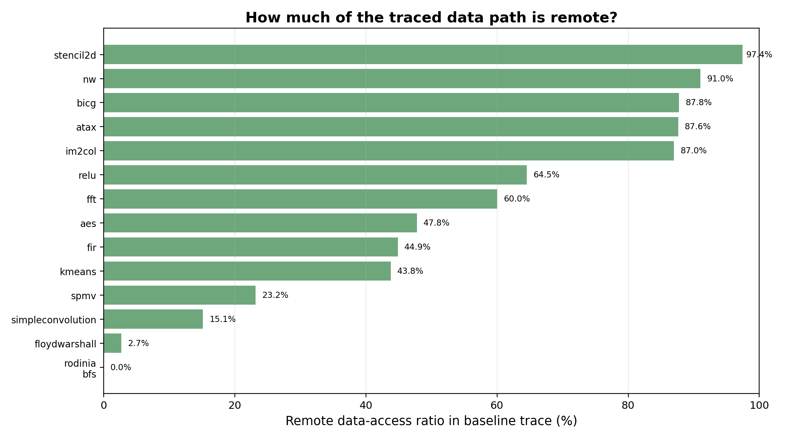
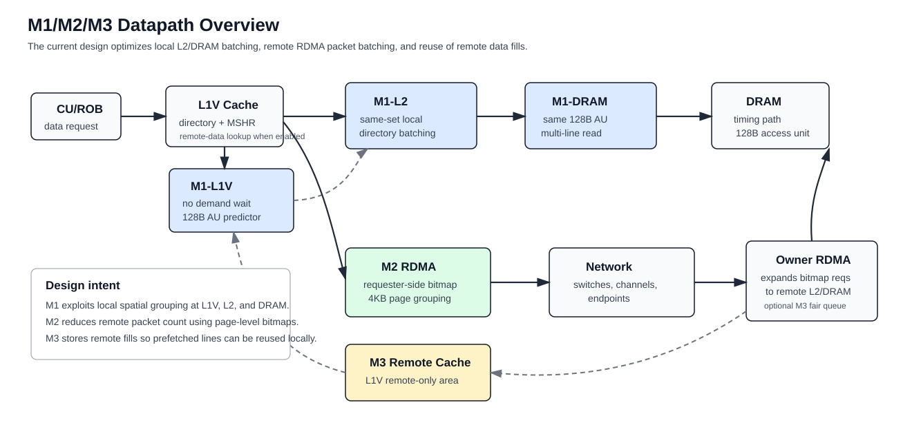
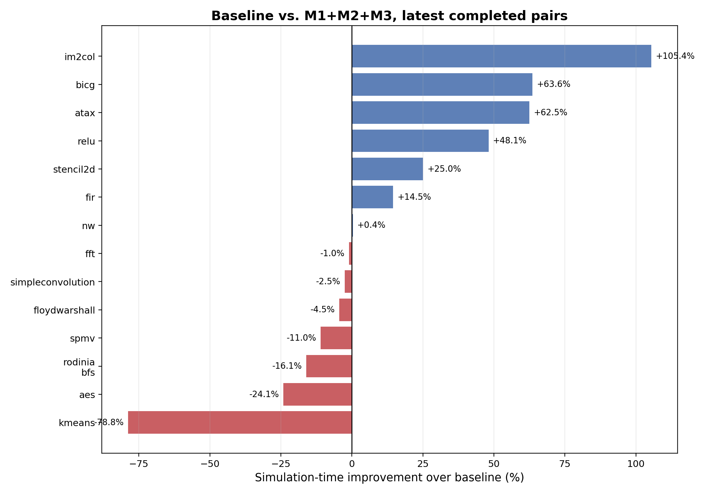
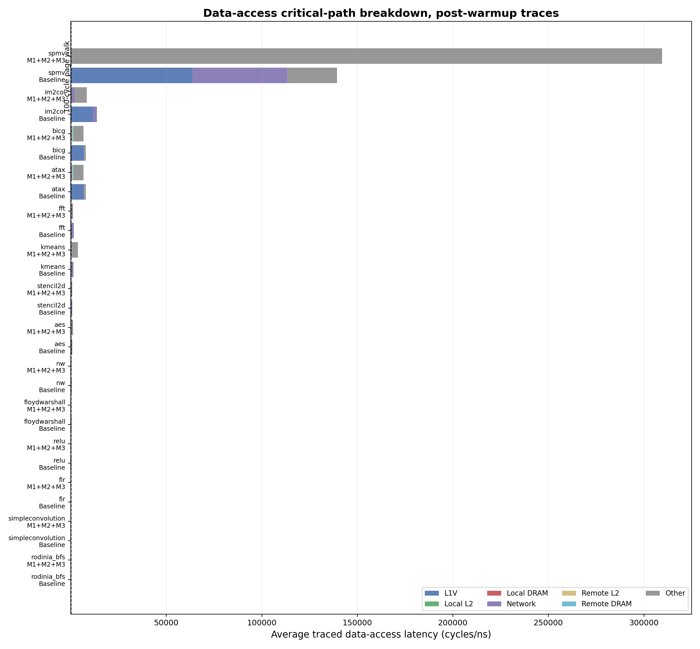

# Locality-Aware Datapath Batching for Wafer-Scale GPU Memory Accesses

**Draft type:** MICRO/ACM-style technical report in Markdown  
**Template basis:** `weeklyreport/temp/main.tex`  
**Simulator stack:** Akita + Akkalat + MGPUSim  
**Current mechanism set:** M1, M2, M3  
**Date:** July 4, 2026

## Abstract

Wafer-scale GPUs expose a large gap between local memory access and remote memory access. A request that misses in the L1V cache can traverse local L2/DRAM, or it can cross the wafer network through RDMA, reach an owner GPU, access the owner-side memory hierarchy, and return through the network. This report describes three mechanisms implemented in the current simulator to reduce that datapath cost. M1 targets local cache/DRAM structure by exploiting same-set L2 directory locality and adjacent 64B cache lines that map to the same 128B DRAM access unit. M2 targets remote accesses by replacing individual remote 64B reads with requester-side page-bitmap RDMA batches. M3 adds a remote-only L1V data area that can capture demand fills and M2 prefetch fills.

The latest paired result set shows a mixed but useful signal. Across 14 completed baseline vs. M1+M2+M3 pairs, the geomean speedup is 1.018x. Several workloads improve substantially, including `im2col` (+105.4%), `bicg` (+63.6%), `atax` (+62.5%), `relu` (+48.1%), and `stencil2d` (+25.0%). Other workloads regress, especially `kmeans`, `aes`, `rodinia_bfs`, and `spmv`. The main interpretation is that the mechanisms often reduce visible L1V/network/local memory components, but end-to-end speedup depends on whether the optimized subpath is actually the runtime critical path and whether batching/prefetching introduces residual queueing or overfetch.

## 1. Introduction

Modern wafer-scale GPU simulation exposes memory behavior that is not well captured by a single cache miss latency. A data request can spend time in address translation, the L1V cache, the local L2 cache, DRAM timing, RDMA request/response paths, the on-wafer network, and remote owner-side L2/DRAM. Optimizing one stage can reduce a measured latency component without improving total runtime if another stage becomes dominant or if the optimization adds waiting, overfetch, or response reassembly overhead.

This work studies a narrow question: can request reordering, batching, and remote-data reuse make the data access path more efficient? The current implementation explores this question through three mechanisms:

1. **M1: local datapath locality optimization.** M1 operates at L1V, local L2, and local DRAM. It predicts adjacent 64B cache-line demand at L1V, batches local L2 same-set probes, and coalesces adjacent L2 misses into larger DRAM reads when they share a 128B access unit.
2. **M2: requester-side RDMA batching.** M2 batches remote 64B reads by requester, owner, PID, and 4KB page, then sends a compact bitmap request instead of multiple independent RDMA requests.
3. **M3: remote-data reuse.** M3 adds a small L1V remote-only data area. It stores remote demand fills and M2 prefetch fills, allowing later remote reads to hit locally.

The contributions of this report are:

- A concrete description of the implemented M1/M2/M3 mechanisms and where they sit in the simulator.
- A summary of the default experimental configuration exposed by `runall2.py`.
- A first-order performance and critical-path analysis using the current July 4 result artifacts.
- A discussion of why latency-component reductions do not always translate into speedup.

## 2. Background and Motivation

The target data path begins when a CU/ROB issues a memory request. The current study separates the path into two broad pieces:

- **Address translation:** request entry into the L1 TLB until translation response completion.
- **Data access:** request entry into the L1V cache until data response completion.

M1/M2/M3 focus on the data-access side. Address translation can remain important, but it is not the primary optimization target in this version.

Figure 1 shows the baseline remote-access ratio from the available trace artifacts. Remote access is not uniform. `rodinia_bfs` has no remote access in this trace sample, while `stencil2d`, `nw`, `bicg`, `atax`, and `im2col` are dominated by remote accesses. This matters because M2 and M3 only help when the workload actually exercises the remote path.



The same trace set also shows that high remote ratio alone is not enough. A workload may have many remote accesses, but if those accesses are not clustered within the same page or 128B access unit, bitmap batching and AU prefetch can add overhead without enough reuse. Conversely, local workloads can still benefit from M1 if their misses have adjacent-line or same-set locality.

## 3. Datapath Overview

Figure 2 summarizes where the mechanisms sit in the data path.



The current `runall2.py` mechanism mapping is important:

| Mechanism arm | Flags added by `runall2.py` | Meaning |
|---|---|---|
| `baseline` | none | Original simulator configuration. |
| `m1` | `-m1-l1v-batch-enable`, `-m1-l2-helper-enable`, `-m1-dram-helper-enable` | Enables all current M1 components. |
| `m2` | `-m2-rdma-batch-enable` | Enables requester-side RDMA bitmap batching. |
| `m3` | `-m3-l1-remote-cache-enable` | Enables the L1V remote-data cache. |
| `m1_m2` | M1 + M2 | Does not enable M2 AU prefetch by default. |
| `m2_m3` | M2 + `-m2-au-prefetch-enable` + M3 | Enables remote AU prefetch and stores fills in M3. |
| `m1_m2_m3` | M1 + M2 + `-m2-au-prefetch-enable` + M3 | Full current mechanism stack used in the latest summary. |

The code also contains an RDMA owner-side fair queue controlled by `-m3-owner-fair-enable`. That feature is implemented, but it is not automatically enabled by the default `m3` or `m1_m2_m3` mechanism arms in `runall2.py`.

## 4. Mechanism 1: Local Datapath Batching and Prediction

M1 was originally motivated by the observation that cache and DRAM structures naturally operate on groups: a cache directory lookup selects one set and scans multiple ways, and the DRAM timing model treats a 64B L2 miss through a 128B access-unit alignment. The current implementation therefore targets three local opportunities.

### 4.1 M1-L1V: No-Wait AU Predictor

Although the flag is still named `-m1-l1v-batch-enable`, the current L1V-side path is not a blocking batch queue. Demand requests are pushed into the L1V directory queue immediately. M1 then observes the request and predicts whether the adjacent line in the same 128B access unit should be prefetched.

The key behavior is:

- It only considers read requests whose size is at most one L1V cache line.
- It treats the default 64B cache line as half of a 128B access unit.
- It groups observations by PID, target low module, and AU ID.
- When it sees two sibling lines in the same AU within the observation window, it rewards a small confidence table.
- When a predicted sibling does not appear before the timeout, it penalizes confidence.
- Once confidence reaches the threshold, M1 issues an internal prefetch for the mate line.

This design avoids delaying demand requests. The cost is that benefit depends on prediction quality. If the adjacent line is not used soon, the prefetch can consume MSHR entries, bottom-port bandwidth, RDMA bandwidth, and owner-side memory service without reducing critical-path latency.

Default exposed parameters:

| Parameter | Default |
|---|---:|
| `m1-l1v-batch-lines` | 2 |
| `m1-l1v-batch-max-wait-ns` | 10 |
| `m1-l1v-batch-entries` | 32 |
| `m1-l1v-adaptive-bad-drains` | 4 |
| `m1-l1v-adaptive-cooldown-ns` | 200 |

The relevant implementation points are:

- `akita/mem/cache/writearound/coalescer.go`: demand requests are forwarded directly and then observed by M1.
- `akita/mem/cache/writearound/m1.go`: predictor state, confidence update, mate-line selection, and internal prefetch issue.
- `akita/mem/cache/writearound/bottomparser.go`: internal prefetch response handling and optional M3 remote-data fill.

### 4.2 M1-L2: Same-Set Local Directory Batching

M1-L2 only applies to local read requests. It groups requests by PID and L2 directory set. The intent is to place requests that probe the same directory set close together, so the directory pipeline sees a more regular access pattern and same-line waiters can be coalesced.

The batch key is:

```text
{ PID, L2 directory set ID }
```

The default configuration is:

| Parameter | Default |
|---|---:|
| `m1-cache-batch-lines` | 4 |
| `m1-cache-batch-max-wait-ns` | 25 |
| `m1-cache-batch-entries` | 16 |

M1-L2 drains when a batch reaches the line threshold, times out, hits capacity pressure, or must be manually drained before a non-batchable request can proceed. When draining, the implementation still pushes transactions into the normal L2 directory pipeline, but it can attach same-cacheline peers as coalesced reads.

The key implementation points are:

- `akita/mem/cache/writeback/topparser.go`: intercepts local read requests before the normal L2 directory path.
- `akita/mem/cache/writeback/m1.go`: same-set batch tables, drain policy, and same-line peer coalescing.

### 4.3 M1-DRAM: 128B Access-Unit Coalescing

M1-DRAM acts after an L2 miss reaches the write-buffer/fetch path. If multiple misses target contiguous 64B lines inside the same 128B DRAM access unit, the helper can issue one larger read rather than separate 64B reads.

The batch key is:

```text
{ PID, low DRAM module, 128B access-unit window }
```

The default configuration is:

| Parameter | Default |
|---|---:|
| `m1-dram-batch-lines` | 2 |
| `m1-dram-batch-max-wait-ns` | 25 |
| `m1-dram-batch-entries` | 16 |

If the collected lines are not contiguous, or if only one line is present, the helper falls back to normal single-line reads. This keeps the mechanism conservative: it only performs true multi-line reads when the request shape matches the underlying DRAM access-unit structure.

The key implementation points are:

- `akita/mem/cache/writeback/writebufferstage.go`: intercepts bottom fetches after local L2 miss.
- `akita/mem/cache/writeback/m1.go`: DRAM batch table, 128B window key, and multi-line read drain.

## 5. Mechanism 2: Requester-Side RDMA Bitmap Batching

M2 targets remote memory accesses. In the baseline path, each remote 64B L1V miss can become an independent RDMA request. This creates many small packets and exposes every request to network switch/channel/endpoint latency.

M2 batches remote reads at the requester-side RDMA engine. It only handles 64B reads that stay within one 4KB page. The batch key is:

```text
{ requester RDMA, owner RDMA, PID, 4KB page physical address }
```

Within a batch, M2 tracks the requested 64B lines using a bitmap. Since a 4KB page contains 64 cache lines, one 64-bit bitmap can describe the requested lines. When the batch reaches the line threshold, times out, or must be flushed for capacity/conflict reasons, M2 sends one `BitmapReadReq`.

Default exposed parameters:

| Parameter | Default |
|---|---:|
| `m2-max-batch-lines` | 8 |
| `m2-max-wait-ns` | 50 |
| `m2-batch-table-entries` | 64 |

The owner RDMA receives the bitmap request, expands each set bit into a local L2 read, waits for all line data, and sends back one `BitmapReadRsp`. The requester then splits the bitmap response into individual `DataReadyRsp` messages for the original L1V demand requests.

In `m2_m3` and `m1_m2_m3`, M2 also enables `-m2-au-prefetch-enable`. With AU prefetch enabled, when line `i` is requested, M2 may add the sibling line `i ^ 1` in the same 128B access unit. If that sibling was not an original demand line, it is returned as a prefetch fill and can be stored by M3.

The key implementation points are:

- `mgpusim/timing/rdma/m2_requester.go`: requester-side batch creation, bitmap flush, AU prefetch line insertion, and response splitting.
- `mgpusim/timing/rdma/m2_owner.go`: owner-side bitmap expansion and bitmap response construction.
- `mgpusim/timing/rdma/m2_m3.go`: `BitmapReadReq`, `BitmapReadRsp`, and statistics structures.

## 6. Mechanism 3: L1V Remote-Data Cache

M3 adds a small remote-only data area to each L1V cache. It is separate from the normal L1V directory/data array. The goal is to keep remote demand fills and M2 prefetch fills close to the requester, so a later remote access can avoid RDMA and network traversal.

Default exposed parameter:

| Parameter | Default |
|---|---:|
| `m3-l1-remote-cache-entries` | 128 64B lines |

The cache is indexed by:

```text
{ PID, 64B cache-line address }
```

It uses LRU replacement. On a remote read, the L1V directory first checks whether the target bottom module is remote. If the line is remote and M3 is enabled, it checks the remote-data cache before sending the request to RDMA. Demand remote fills and prefetch fills can both populate this structure. Writes invalidate matching remote-data entries.

The implementation is in:

- `akita/mem/cache/writearound/m3_remote.go`: remote-data cache storage, lookup, fill, invalidation, and statistics.
- `akita/mem/cache/writearound/directory.go`: remote-data lookup before remote miss handling.
- `akita/mem/cache/writearound/bottomparser.go`: remote demand fill and prefetch fill handling.

The RDMA owner fair queue is also implemented under the M3 name, but it is controlled by `-m3-owner-fair-enable` and is not part of the default `m3` mechanism arm used by `runall2.py`. It provides per-requester queues with deficit round-robin scheduling, a consecutive-service cap, and a hard-age escape.

## 7. Experimental Methodology

The current result figures are stored in:

```text
weeklyreport/07042026/figures/
```

The main result files are:

- `m1_m2_m3_latest_summary.csv`: paired runtime summary where both baseline and M1+M2+M3 are available.
- `critical_path_breakdown_avg.csv`: average data-access critical-path breakdown in cycles.
- `baseline_remote_ratio.csv`: baseline remote-access ratio from the traced memory-path records.

The relevant run configuration is the `sample_all` configuration with baseline and M1+M2+M3 mechanisms. The tracing artifacts focus on the data-access path after warmup and report average cycle components for:

- L1V cache handling,
- local L2,
- local DRAM,
- network,
- remote L2,
- remote DRAM,
- residual other time.

The current accounting intentionally excludes the previously confusing MSHR-wait bucket and the local-L2-to-L1V response component that could double count return-path time. The `Other` bucket therefore means residual traced time not assigned to the named components above.

## 8. Performance Results

Figure 3 shows runtime improvement of M1+M2+M3 over baseline. Positive values indicate speedup; negative values indicate slowdown.



The completed paired results are:

| Benchmark | Baseline us | M1+M2+M3 us | Speedup | Improvement |
|---|---:|---:|---:|---:|
| `aes` | 4.691 | 6.182 | 0.759x | -24.1% |
| `atax` | 337.560 | 207.715 | 1.625x | +62.5% |
| `bicg` | 338.032 | 206.626 | 1.636x | +63.6% |
| `fft` | 5.866 | 5.928 | 0.990x | -1.1% |
| `fir` | 5.766 | 5.034 | 1.145x | +14.5% |
| `floydwarshall` | 4.613 | 4.828 | 0.956x | -4.5% |
| `im2col` | 79.210 | 38.560 | 2.054x | +105.4% |
| `kmeans` | 13.735 | 64.909 | 0.212x | -78.8% |
| `nw` | 2232.463 | 2224.402 | 1.004x | +0.4% |
| `relu` | 6.402 | 4.322 | 1.481x | +48.1% |
| `rodinia_bfs` | 47.990 | 57.190 | 0.839x | -16.1% |
| `simpleconvolution` | 6.013 | 6.169 | 0.975x | -2.5% |
| `spmv` | 603.664 | 678.418 | 0.890x | -11.0% |
| `stencil2d` | 12.205 | 9.761 | 1.250x | +25.0% |

The geomean speedup over these 14 paired workloads is **1.018x**. The result is therefore not a broad end-to-end win yet, but it contains clear positive cases. The large gains in `im2col`, `atax`, `bicg`, and `relu` suggest that the mechanisms can help when the data path has enough locality or remote batching opportunity. The regressions show that the current policy is still too aggressive or that the optimized datapath is not always the actual end-to-end bottleneck.

Some benchmarks in the latest summary have M1+M2+M3 data but no paired baseline in the current CSV:

| Benchmark | Baseline us | M1+M2+M3 us | Status |
|---|---:|---:|---|
| `bitonicsort` | N/A | 8.031 | baseline missing |
| `fastwalshtransform` | N/A | 9.763 | baseline missing |
| `matrixmultiplication` | N/A | 4.688 | baseline missing |
| `matrixtranspose` | N/A | 8.400 | baseline missing |
| `pagerank` | N/A | 80.918 | baseline missing |

These should not be included in paired speedup claims until the baseline runs complete successfully.

## 9. Critical-Path Breakdown

Figure 4 shows the average data-access critical-path breakdown in cycles. The figure is useful because it shows whether the mechanisms reduce the intended datapath components, even when kernel runtime does not improve.



Several observations stand out:

1. **The mechanisms often reduce visible L1V time.** For `relu`, L1V drops from 111.6 cycles to 1.3 cycles on the traced average path. For `stencil2d`, it drops from 264.8 cycles to 1.1 cycles. For `atax`, `bicg`, `im2col`, and `spmv`, the visible L1V component also drops dramatically.
2. **Network time can drop, but not always.** `fft` drops from 1296.9 network cycles to 130.4 cycles, and `stencil2d` drops from 461.7 to 178.6. However, `atax`, `bicg`, and `im2col` show larger network components under M1+M2+M3, which is consistent with extra batched/prefetched remote traffic or different request exposure.
3. **The residual `Other` bucket often grows.** This is the biggest warning sign. In `spmv`, `Other` grows to 309k cycles. In `kmeans`, it grows to 3275 cycles. In `aes`, it grows to 731 cycles. This means the mechanism can move time out of named L1V/network buckets without removing it from the end-to-end critical path.
4. **Low-remote workloads have limited M2/M3 opportunity.** `rodinia_bfs` has 0% remote access in the trace, so M2/M3 should not be expected to help. Its regression likely comes from local-side M1 overhead or noise in the sampled execution.

This critical-path result explains why speedup is small overall. The optimized components improve in many cases, but the residual path, owner-side service, prefetch overhead, or workload-level synchronization can dominate the final runtime.

## 10. Interpreting Good and Bad Cases

### 10.1 Positive Cases

`im2col`, `atax`, `bicg`, and `relu` are the strongest positive examples.

- `im2col` has a high remote ratio and a large baseline L1V/network component. M1+M2+M3 reduces visible L1V time and improves runtime by 105.4%.
- `atax` and `bicg` both have high remote ratios, and both improve by more than 60%. Their similar behavior suggests that the access pattern is regular enough for batching or prefetching to matter.
- `relu` improves by 48.1%. Its traced L1V component drops sharply, and network time also decreases modestly.

These cases support the claim that locality-aware data-path mechanisms can reduce effective memory-access cost when request patterns expose adjacent-line or page-local batching opportunities.

### 10.2 Negative Cases

`kmeans`, `aes`, `rodinia_bfs`, and `spmv` are the most important regressions.

- `kmeans` has a high remote ratio, but runtime regresses by 78.8%. Its network bucket drops substantially, but `Other` grows dramatically. This suggests that M2/M3 may be reducing packet-visible network time while introducing waiting, response reassembly, prefetch-fill pressure, or owner-side service imbalance that is not captured by the named buckets.
- `aes` regresses by 24.1%. Network time drops, but the residual `Other` bucket grows to dominate. This is a sign that the optimization changes where time is spent rather than removing critical-path time.
- `rodinia_bfs` has no remote accesses in the baseline trace sample, so remote batching and remote cache are irrelevant. Any overhead from local M1 can hurt.
- `spmv` has many remote accesses, but it regresses by 11.0%. The trace shows a very large residual component under M1+M2+M3, indicating that the current batching/prefetch policy is probably not aligned with the true critical path.

These cases argue for adaptivity rather than always-on batching/prefetching.

## 11. Why Latency Reduction Does Not Always Produce Speedup

The current results show that a mechanism can be effective on a subpath while still failing to produce end-to-end speedup. M1 can reduce visible L1V or local DRAM handling, and M2 can reduce the number of independent remote packets, but the application runtime only improves if that reduced component is on the true critical path. If batching waits too long, prefetches unused lines, increases owner-side L2/DRAM pressure, or shifts time into response reassembly and residual queueing, the named latency buckets may shrink while total kernel time remains flat or worsens. This is why the critical-path breakdown must be read together with runtime speedup, not as a replacement for it.

## 12. Design Implications

The current mechanisms should be treated as a proof-of-concept rather than a final policy. The evidence suggests the following design direction:

- **M1 should stay conservative at L1V.** The no-wait predictor is safer than holding demand requests, but it still needs confidence and usefulness tracking to avoid harmful prefetches.
- **M1-DRAM is structurally clean.** Two adjacent 64B lines inside one 128B DRAM access unit are the most natural batch target. This should remain part of the core design.
- **M2 needs usefulness control.** Bitmap batching is attractive when lines cluster within a page and when the owner-side memory system can service the batch efficiently. It is risky when batches mostly add prefetch lines or when owner-side expansion becomes the bottleneck.
- **M3 only helps with reuse.** The remote-data cache needs demand hits or prefetch-demand hits. If remote lines are rarely reused, M3 becomes storage and fill overhead.
- **The next policy should be adaptive.** Good signals include remote ratio, AU prefetch hit rate, M2 average lines per bitmap packet, owner queue wait, remote-data cache hit rate, and residual `Other` critical-path growth.

## 13. Implementation Reference

| Component | Main files | Main role |
|---|---|---|
| M1 L1V predictor | `akita/mem/cache/writearound/coalescer.go`, `akita/mem/cache/writearound/m1.go` | Observe demand requests and issue no-wait mate-line prefetches. |
| M1 L2 batch | `akita/mem/cache/writeback/topparser.go`, `akita/mem/cache/writeback/m1.go` | Batch local same-set reads before the L2 directory pipeline. |
| M1 DRAM batch | `akita/mem/cache/writeback/writebufferstage.go`, `akita/mem/cache/writeback/m1.go` | Coalesce contiguous 64B L2 misses in one 128B DRAM access unit. |
| M2 requester batch | `mgpusim/timing/rdma/m2_requester.go` | Build bitmap RDMA requests and split bitmap responses. |
| M2 owner expansion | `mgpusim/timing/rdma/m2_owner.go` | Expand bitmap requests into owner-side local L2 reads. |
| M2 message types | `mgpusim/timing/rdma/m2_m3.go` | Define `BitmapReadReq`, `BitmapReadRsp`, and stats. |
| M3 remote cache | `akita/mem/cache/writearound/m3_remote.go` | Store remote demand/prefetch fills in an L1V-side remote-only area. |
| M3 owner fair queue | `mgpusim/timing/rdma/m3_owner.go` | Optional owner-side per-requester fair scheduling. |
| Experiment mapping | `akkalat/runall2.py` | Maps `baseline`, `m1`, `m2`, `m3`, and combined mechanism arms to flags. |
| Runtime flags | `akkalat/baseline/runner/flag.go` | Exposes M1/M2/M3 and memory-path trace knobs. |

## 14. Conclusion

The current M1/M2/M3 implementation demonstrates that data-path batching and remote-data reuse can produce real improvements, but the wins are workload dependent. The strongest evidence comes from workloads with high remote ratio and regular access structure, where M1+M2+M3 improves runtime by 25% to more than 100%. The weakest cases show that batching and prefetching can move latency into residual queueing or owner-side service rather than removing it. The next step is therefore not simply to make the mechanisms more aggressive, but to make them adaptive: enable batching and prefetching only when the trace counters show that they reduce the actual critical path.
